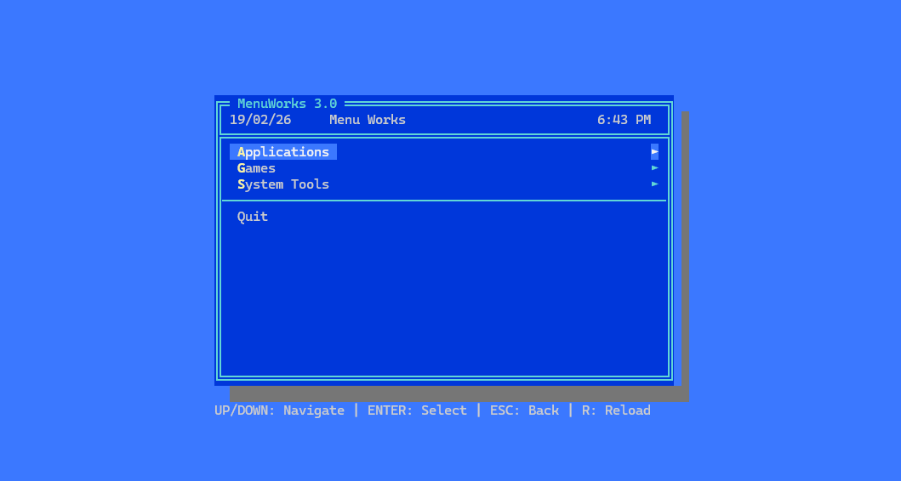
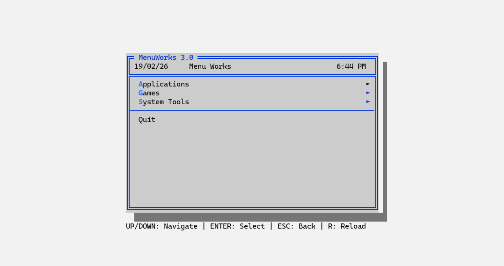

# MenuWorks 3.X

A **retro DOS-style hierarchical menu TUI application** for Windows, Linux, and macOS,  heavily inspired by the [MenuWorks 2.10](https://www.peteravritch.com/portfolio/menuworks21) application released in 1987. Built in Go with a single, self-contained binary that requires no external dependencies. Configuration is done via a single yaml file.

[](https://github.com/benleov/menuworks-3/releases/)   [](https://github.com/benleov/menuworks-3/actions/workflows/ci.yml) [](https://github.com/benleov/menuworks-3/actions/workflows/release.yml)

## Legal Note

MenuWorks 3.X is an independent modern implementation inspired by the original MenuWorks 2.10 (1987). This is a new application built from scratch in Go and is not affiliated with or derived from the original software.

This project is created for educational and preservation purposes as homage to a classic DOS utility.

If you're interested in research into the binary format of the original MenuWorks application, check out [this](https://benleov.github.io/menuworks/) page.

## Screenshots

### Retro theme

[](./images/retro.png)

### Light theme

[](./images/light.png)


## Features

- **Single Self-Contained Binary** — No runtime dependencies, no external files required (except config)
- **Retro DOS Aesthetic** — 80×25 terminal layout with double-line borders, drop shadows, and VGA colors
- **Customizable Themes** — Define and switch between named color themes in the YAML config
- **Hierarchical Menus** — Unlimited menu nesting with menu chaining via `target`
- **Hotkeys** — Explicit hotkey assignment or auto-generated from menu labels
- **Item Help Text** — Optional help descriptions for command items (press F2 to view)
- **Configuration** — YAML-based config file (`config.yaml`) with embedded default fallback
- **Cross-Platform Commands** — Execute shell commands (auto-detects Windows cmd.exe vs sh)
- **Command Output Viewer** — Scrollable full-screen display of command output with ↑/↓ and PgUp/PgDn navigation
- **Dynamic Config Reload** — Press `R` in any menu to reload config without restarting
- **Selection Memory** — Current menu position preserved during session (resets on config reload)
- **Scrollable Menus** — Menus with more items than fit on screen scroll automatically with ▲/▼ indicators
- **Graceful Error Handling** — Clear error dialogs for missing config, invalid YAML, and broken menu links

## Installation

### Option 1: Download Pre-Built Binary

Download the latest binary for your platform:
- **Windows**: `dist/menuworks-windows.exe`
- **Linux**: `dist/menuworks-linux`
- **macOS (Intel)**: `dist/menuworks-macos`
- **macOS (ARM/M1)**: `dist/menuworks-macos-arm64`

Place the binary anywhere, optionally alongside a `config.yaml` file.

**Running Pre-Built Binaries:**

```bash
./menuworks-windows.exe      # Windows
./menuworks-linux            # Linux
./menuworks-macos            # macOS
```

**Custom config file location:**

```bash
./menuworks-windows.exe -config C:\path\to\my-config.yaml
./menuworks-linux -config /etc/menuworks/config.yaml
```

If `-config` is not specified, MenuWorks looks for `config.yaml` in the same directory as the binary.

**Platform Security Notes for Pre-Built Binaries:**

On first run, you may see OS security warnings (unsigned binary). These are one-time:

- **Windows**: Windows Defender SmartScreen appears → Click **"More Info"** → **"Run Anyway"**
- **macOS**: Gatekeeper blocks the binary → Run: `xattr -rd com.apple.quarantine ./menuworks-macos`
- **Linux**: No warnings

Subsequent runs work without prompts. (See [Security & Trust](#security--trust) section for details.)

### Option 2: Build from Source

**Requirements:**
- Go 1.21+ (portable installation extracted to: `bin/go/`)
- Windows, Linux, or macOS

**Build All Platforms:**
```powershell
# PowerShell (Windows)
.\build.ps1

# Bash (Unix/Linux/macOS)
chmod +x build.sh
./build.sh
```

**Build Single Target:**
```powershell
# PowerShell
.\build.ps1 -Target windows -Version 1.0.0

# Bash
./build.sh linux
```

Binaries are output to `dist/`. **No security warnings** when you build from source.

**Running Locally Built Binaries:**

```bash
./dist/menuworks-windows.exe      # Windows
./dist/menuworks-linux            # Linux
./dist/menuworks-macos            # macOS
```

The binary creates a default `config.yaml` on first run if one doesn't already exist.

## Publishing Releases

MenuWorks uses **GitHub Actions** to automatically build, test, and publish releases to GitHub Releases.

### How to Create a Release

1. **Update CHANGELOG.md** with notes for the new version (optional — GitHub auto-generates from commits):
   ```markdown
   ## [1.1.0] - 2026-02-20
   
   ### Added
   - New feature description
   
   ### Fixed
   - Bug fix description
   ```

2. **Create and push a git tag** to trigger the release workflow:
   ```bash
   git tag v1.1.0
   git push origin v1.1.0
   ```

3. **Wait for GitHub Actions to complete**:
   - ✅ **CI Tests** runs: `./config` and `./menu` packages tested
   - ✅ **Build & Release** runs (if tests pass):
     - Cross-compiles for Windows, Linux, macOS (Intel + ARM64)
     - Generates SHA256 checksums
     - Creates GitHub Release with auto-generated release notes
     - Uploads all 4 binaries + checksums.txt

4. **Release automatically published** at [github.com/benworks/menuworks/releases](https://github.com/benworks/menuworks/releases)

### Release Artifacts

Each release includes:
- `menuworks-windows.exe` — Windows 64-bit executable
- `menuworks-linux` — Linux 64-bit executable
- `menuworks-macos` — macOS Intel (x86_64) executable
- `menuworks-macos-arm64` — macOS Apple Silicon (ARM64) executable
- `checksums.txt` — SHA256 checksums for all binaries (verify integrity with `sha256sum -c checksums.txt`)

### Version Injection

The version is automatically injected into the binary at compile-time via `-ldflags` when the tag is pushed. The binary displays the version in the splash screen on startup.

**No manual version editing is required** — the tag name (e.g., `v1.0.0`) is extracted and passed to the build process.

### Verify Checksums

After downloading binaries:
```bash
sha256sum -c checksums.txt
# Output: menuworks-linux: OK
```

### CI/CD Status

- **CI Workflow**: Runs on every pull request to `main`. Tests must pass before merging.
- **Release Workflow**: Triggered automatically on git tags matching `v*` (e.g., `v1.0.0`). Releases are published to GitHub only if tests pass.

---

## Configuration

MenuWorks uses a **YAML configuration file** located in the same directory as the binary (or specified via environment).

### Default Config

On first run, if `config.yaml` is missing, MenuWorks creates one with sample menus and commands.

### Configuration Schema

```yaml
title: "MenuWorks 3.X"

items:
  - type: submenu
    label: "System Tools"
    hotkey: "S"           # Optional; auto-assigned if omitted
    target: "system"      # Menu name to open

  - type: command
    label: "Show Date"
    hotkey: "D"
    exec:
      windows: "echo Current date is %DATE%"  # Windows command
      linux: "date"                            # Linux command
      mac: "date"                              # macOS command
    showOutput: false   # disable output from command (e.g for app links)

  - type: separator       # Visual divider (no label or hotkey)

  - type: back
    label: "Quit"         # Root menu "back" = exit; submenu "back" = return

menus:
  system:
    title: "System Tools"
    items:
      - type: command
        label: "List Files"
        exec:
          windows: "dir"
          linux: "ls -la"
          mac: "ls -la"
      
      - type: back
        label: "Back"
```

### Item Types

| Type | Purpose | Fields |
|------|---------|--------|
| `command` | Run shell command | `label`, `exec` (OS variants), `hotkey` (optional), `help` (optional), `showOutput` (optional) |
| `submenu` | Open another menu | `label`, `target` (menu name), `hotkey` (optional) |
| `back` | Return to parent (or quit if root) | `label` |
| `separator` | Visual divider | *(no other fields)* |

### Cross-Platform Command Execution

MenuWorks supports **OS-specific commands** via the `exec` field. Each command item must define variants for the operating systems you want to support:

```yaml
- type: command
  label: "Show System Info"
  exec:
    windows: "systeminfo"
    linux: "uname -a"
    mac: "uname -a"
```

**Behavior:**
- If the current OS has a defined variant, that command executes
- If the current OS variant is missing, the item appears **disabled** (dimmed) in the menu
- At least one OS variant must be defined for each command

**Supported OS identifiers:**
- `windows` — Windows (cmd.exe)
- `linux` — Linux (sh)
- `mac` — macOS (sh)

### Hotkeys

- **Explicit assignment**: Use `hotkey: "S"` on any item
- **Auto-assignment**: Left-to-right scan of the label for the first unused letter
  - Non-alphabetic characters are skipped
  - Example: "Run (Backup)" → scans R, U, N, B, A, C, K, U, P → uses first available

### Help Text for Commands

Command items can optionally include a `help` field to provide users with contextual information about what the command does. When a user selects a command item and presses **F2**, a dialog box appears showing:
- The actual command that will be executed (OS-specific variant)
- The help text, if provided

**Example:**

```yaml
- type: command
  label: "Show System Info"
  hotkey: "I"
  help: "Displays detailed information about your system hardware and OS."
  exec:
    windows: "systeminfo"
    linux: "uname -a"
    mac: "system_profiler SPSoftwareDataType"
```

When the user presses **F2** on this item, they see:
```
┌─ Item Info ─────────────────────────────┐
│ Command:                                │
│ systeminfo                              │
│                                         │
│ Displays detailed information about     │
│ your system hardware and OS.            │
│                                         │
│             [OK]                        │
└─────────────────────────────────────────┘
```

The `help` field is **optional** — if omitted, F2 still works and displays just the command.

### Command Output Display

By default, all commands display their output in a scrollable full-screen viewer after execution. To hide output for a command (e.g., for background tasks), set `showOutput: false`:

```yaml
- type: command
  label: "Silent Task"
  exec:
    command: "some-background-task.sh"
  showOutput: false  # Output will not be displayed
```

### Themes

MenuWorks supports **customizable color themes** defined in your `config.yaml` file. You can create multiple named themes and switch between them.

#### Define a Theme

Add a `themes:` section to your config with one or more named color schemes:

```yaml
theme: "dark"  # Select which theme to use

themes:
  dark:
    background: "blue"
    text: "silver"
    border: "aqua"
    highlight_bg: "navy"
    highlight_fg: "white"
    hotkey: "yellow"
    shadow: "gray"
    disabled: "gray"
  
  light:
    background: "white"
    text: "black"
    border: "navy"
    highlight_bg: "silver"
    highlight_fg: "black"
    hotkey: "blue"
    shadow: "gray"
    disabled: "gray"
```

#### Supported Colors

Use any of these **16 named colors** (plus aliases):

`black`, `white`, `red`, `blue`, `green`, `yellow`, `aqua` (or `cyan`), `silver`, `gray` (or `grey`), `navy`, `maroon`, `purple`, `teal`, `olive`, `lime`, `fuchsia`

**Invalid or missing colors automatically fall back to defaults**, so your config remains valid even with theme errors.

#### Theme Reload

Press **R** in any menu to reload your config **and apply the new theme** immediately — no restart needed.

## Usage

### Command-Line Flags

| Flag | Description | Default |
|------|-------------|---------|
| `-config <path>` | Path to config.yaml file | Same directory as binary |
| `-menu <name>` | Initial menu to display on startup | Root menu |
| `-no-splash` | Skip the splash screen | Show splash |

All flags can also be set in `config.yaml` (see `initial_menu` and `splash_screen`). CLI flags override config values.
### Navigation

| Key | Action |
|-----|--------|
| **↑ / ↓** | Move selection (in menu, scrolls when needed); scroll up/down (in output viewer) |
| **→ / Enter** | Select/open submenu or execute command |
| **← / Esc** | Return to parent menu (or quit at root); return to menu from output viewer |
| **PgUp / PgDn** | Page up/down in output viewer |
| **F2** | Show help dialog for the selected command item (displays command and optional help text) |
| **R** | Reload config (in menu view only) |
| **Hotkey** (A-Z) | Directly activate menu item |
| **Any Other Key** | Return to menu from output viewer |

### Terminal Requirements

- **Minimum**: 80×25 character terminal
- **Resize handling**: If terminal is too small, an error dialog appears; resize and the UI auto-recovers
- **On resize dialog**: Press **Esc** to quit, or resize terminal to continue

## Examples

### Example 1: Simple Admin Menu (Cross-Platform)

```yaml
title: "Admin Panel"

items:
  - type: submenu
    label: "System"
    target: "sys"
  
  - type: submenu
    label: "Network"
    target: "net"
  
  - type: separator
  
  - type: back
    label: "Exit"

menus:
  sys:
    title: "System Tools"
    items:
      - type: command
        label: "Disk Usage"
        exec:
          windows: "wmic logicaldisk get name,size,freespace"
          linux: "df -h"
          mac: "df -h"
        showOutput: true  # Default - show output in viewer
      
      - type: command
        label: "Processes"
        exec:
          windows: "tasklist"
          linux: "ps aux"
          mac: "ps aux"
      
      - type: back
        label: "Back"

  net:
    title: "Network Tools"
    items:
      - type: command
        label: "Ping Google"
        exec:
          windows: "ping 8.8.8.8 -n 1"
          linux: "ping -c 1 8.8.8.8"
          mac: "ping -c 1 8.8.8.8"
      
      - type: back
        label: "Back"
```

### Example 2: Development Tools

```yaml
title: "Dev Tools"

items:
  - type: submenu
    label: "Build & Deploy"
    target: "build"
  
  - type: submenu
    label: "Testing"
    target: "test"

menus:
  build:
    title: "Build & Deploy"
    items:
      - type: command
        label: "Build Project"
        exec:
          windows: "cargo build --release"
          linux: "cargo build --release"
          mac: "cargo build --release"
      
      - type: command
        label: "Deploy to Staging"
        exec:
          windows: ".\\scripts\\deploy-staging.bat"
          linux: "./scripts/deploy-staging.sh"
          mac: "./scripts/deploy-staging.sh"
      
      - type: back
        label: "Back"

  test:
    title: "Testing"
    items:
      - type: command
        label: "Run Unit Tests"
        exec:
          windows: "cargo test"
          linux: "cargo test"
          mac: "cargo test"
      
      - type: command
        label: "Run Integration Tests"
        exec:
          windows: "cargo test --test '*'"
          linux: "cargo test --test '*'"
          mac: "cargo test --test '*'"
      
      - type: back
        label: "Back"
```

## Security & Trust

### Binary Verification

All released binaries include **SHA256 checksums** for integrity verification:

```bash
# Download both the binary and checksums.txt from the release
# Verify the binary matches its checksum:
sha256sum -c checksums.txt

# macOS / BSD:
shasum -a 256 -c checksums.txt

# Windows PowerShell:
(Get-FileHash menuworks-windows.exe -Algorithm SHA256).Hash -eq (Get-Content checksums.txt | Select-String "menuworks-windows.exe" | ForEach-Object { $_.ToString().Split()[0] })
```

### Platform Security Warnings

MenuWorks only requires **write access to `config.yaml`** (in the binary's directory). It does not require:
- Network access
- System-wide installation
- Administrative permissions
- Access to other files or directories

#### Windows: SmartScreen Warning

**Why it appears:** Binaries from unknown publishers may trigger Windows Defender SmartScreen on first run.

**What to do:**
1. Download the binary from [GitHub Releases](https://github.com/benleov/menuworks-3/releases)
2. **Verify the SHA256 checksum** (see above)
3. When SmartScreen appears, click **"More Info"** → **"Run Anyway"**
4. The binary is now trusted for future runs

The warning is a one-time friction point; subsequent runs launch without prompts.

#### macOS: Gatekeeper & Unsigned Binary

**Why it appears:** Unsigned binaries are blocked by macOS Gatekeeper on first run.

**What to do:**

```bash
# 1. Download binary from GitHub Releases
# 2. Verify SHA256 checksum
# 3. Make executable (if needed)
chmod +x menuworks-macos

# 4. Remove the quarantine attribute
xattr -rd com.apple.quarantine ./menuworks-macos

# 5. Run normally
./menuworks-macos
```

After removing the quarantine attribute, subsequent runs work without prompts.

**Why unsigned?** Code signing with a free certificate cannot bypass Apple's Gatekeeper completely (Gatekeeper only fully trusts paid Developer ID certificates). The approach above is standard for open-source projects distributed via GitHub.

### Build Transparency

MenuWorks builds are **deterministic and reproducible**:

- Source code is public on [GitHub](https://github.com/benleov/menuworks-3)
- Binaries are built on GitHub Actions (visible in [CI logs](https://github.com/benleov/menuworks-3/actions))
- Build flags and Go version are documented in [release.yml](.github/workflows/release.yml)
- All dependencies are pinned in [go.mod](go.mod) and [go.sum](go.sum)

You can **build from source** using the included scripts (see [Build from Source](#option-2-build-from-source)) and verify the resulting binary matches the released version:

```bash
# Build from source
./build.sh all

# Compare checksums
sha256sum dist/menuworks-linux
```

## Troubleshooting

### Config File Not Found

MenuWorks looks for `config.yaml` in:
1. The path specified by `-config` flag (if provided)
2. Same directory as the binary (default)

If neither exists, MenuWorks creates the embedded default config at the resolved path.

### YAML Parse Error

MenuWorks shows a dialog with:
- **Retry** — Fix the file and try again
- **Use Default** — Load embedded default config
- **Exit** — Quit application

### Menu Item Not Appearing

Check:
- Item type is valid: `command`, `submenu`, `back`, `separator`
- For `submenu` items: `target` menu exists in `menus:`
- YAML indentation is correct (spaces, not tabs)
- No invalid field names in the config

### Terminal Resize Issue

MenuWorks automatically handles terminal resize. If the terminal is too small (<80×25), an error dialog appears. Resize your terminal to at least 80×25 and it auto-recovers.

## Architecture

```
menuworks/
├── cmd/menuworks/
│   └── main.go              # Entry point, event loop
├── config/
│   └── config.go            # YAML loading, validation, embedding
├── menu/
│   └── navigator.go         # Menu navigation state, hotkey assignment
├── ui/
│   ├── screen.go            # Terminal rendering (tcell wrapper)
│   └── menu.go              # Menu/dialog drawing
├── exec/
│   └── exec.go              # Cross-platform command execution
├── assets/
│   └── config.yaml          # Embedded default config
├── build.ps1                # PowerShell build script
├── build.sh                 # Bash build script
└── go.mod                   # Go module definition
```

### Key Design Decisions

- **Single Binary**: All assets (config template, logo) embedded via `//go:embed`
- **Mouse Support**: Optional mouse support (scroll, click) — enabled by default, disable with `mouse_support: false`
- **Deterministic Rendering**: No flicker, smooth 400ms splash screen
- **Selection Memory**: Per-session tracking allows quick menu traversal
- **Config Reload**: Live reload without losing user's current menu depth

## Dependencies

- **tcell/v2** — Terminal rendering library
- **gopkg.in/yaml.v3** — YAML parsing

Both are included in `go.mod` and automatically downloaded during build.

## Performance

- **Binary Size**: ~8-15 MB (single executable)
- **Startup Time**: <100ms (excluding splash screen delay)
- **Memory Usage**: ~5-10 MB
- **Rendering**: 60 FPS (smooth on all platforms)

## Platform Notes

### Windows

- Assumes `cmd.exe` for command execution
- Windows Terminal or ConEmu recommended for best colors
- Tested on Windows 10/11

### Linux

- Uses `/bin/sh` for command execution
- Tested on Ubuntu 20.04+, Fedora, Debian
- SSH terminal support: Yes

### macOS

- Uses `/bin/sh` for command execution
- Intel (amd64) and Apple Silicon (arm64) builds provided
- Tested on macOS 11+

## Building for Different Architectures

```powershell
# Windows - ARM64 (future-proofing)
$env:GOOS = "windows"; $env:GOARCH = "arm64"
go build -o dist/menuworks-arm64.exe cmd/menuworks/main.go

# Linux - ARM64 (Raspberry Pi, etc.)
$env:GOOS = "linux"; $env:GOARCH = "arm64"
go build -o dist/menuworks-arm64 cmd/menuworks/main.go
```

## License

MIT License — See LICENSE file for details.
